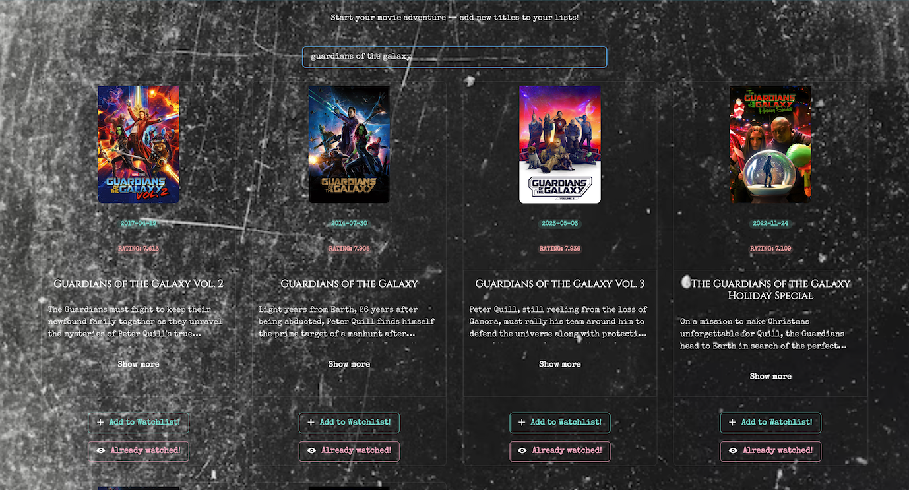
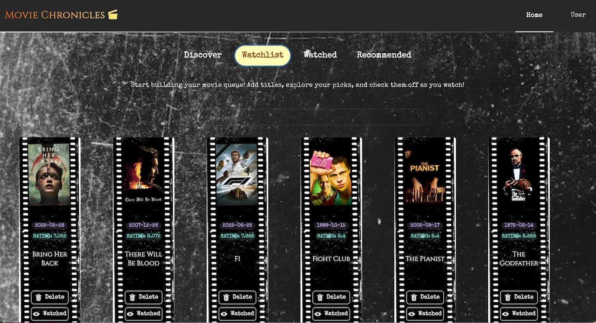
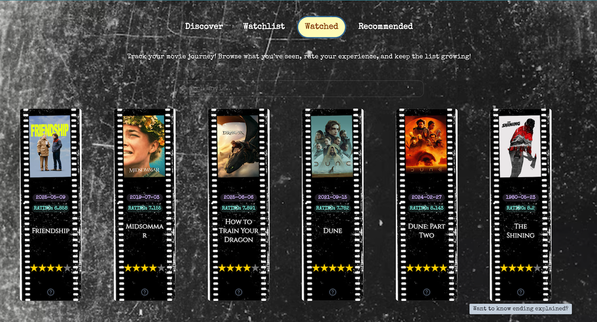
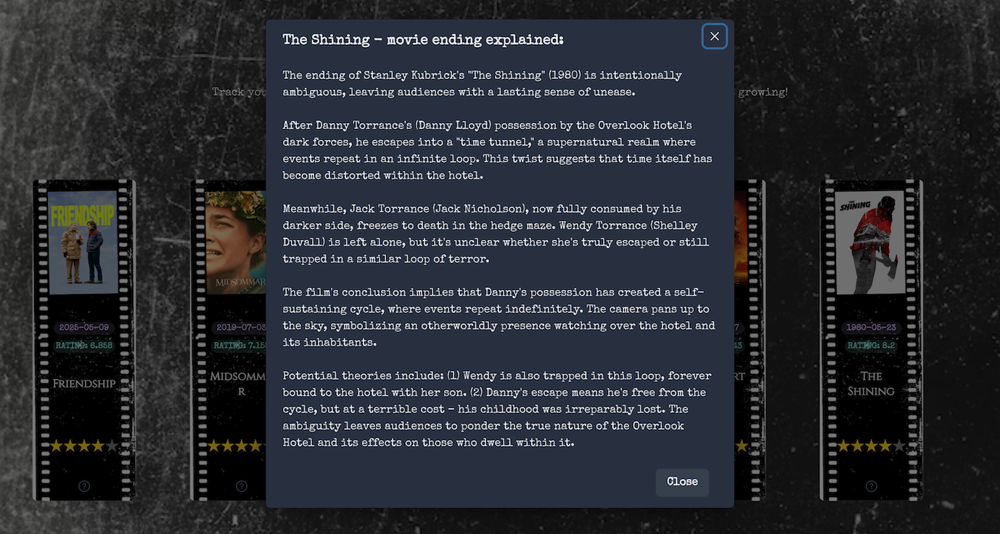

# Movie Chronicles App 

A personal CRUD application for tracking movies, managing watchlists, and generating AI-powered insights.

## Tech Stack
- **Backend**: Django (REST Framework)
- **Frontend**: React
- **Database**: PostgreSQL
- **AI/ML**: Llama model

## Features
- **Authentication**: User registration, login, and profile management.
- **Search**: Search interface to find movies for tracking.
- **Lists**: Add and remove movies from "Watched" and "To Watch" lists.
- **AI Explanations**: Generates breakdowns of movie endings using the Llama model.
- **CRUD Operations**: Complete management of user movie entries and ratings.

## Screenshots

### Search & Discovery




### Watchlist


### Watched movies


### AI Ending Explained

*Llama model generating a summary of a movie's finale.*

## Installation

### Backend
1. Navigate to `/backend`
2. Install dependencies: `pip install -r requirements.txt`
3. Run migrations: `python manage.py migrate`
4. Start server: `python manage.py runserver`

### Frontend
1. Navigate to `/frontend`
2. Install packages: `npm install`
3. Start application: `npm start`

## Environment Variables
Create a `.env` file in the backend directory:
```env
TMDB_API_KEY=your_tmdb_api_key
